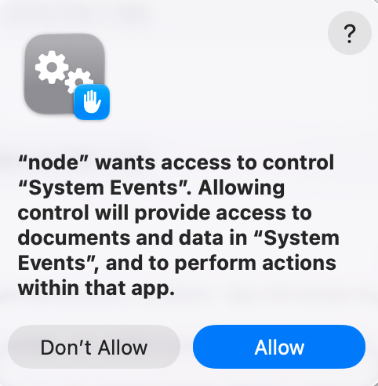

# How to Install (macOS)

## Step 1 — Install the Plugin

Logi Options+ → Marketplace → Search "MX Kiro" → Install.
Buttons appear on your MX Creative Console.

## Step 2 — Install the Bridge (one command)

```bash
curl -fsSL https://raw.githubusercontent.com/memetcircus/mxkiro-mac/main/scripts/install.sh | bash
```

This will:
- Clone the repo to `~/.mxkiro/`
- Run `npm install`
- Register Bridge with launchd (auto-starts on login)
- Start Bridge immediately

## Step 3 — Grant macOS Permissions

On first use, macOS will ask "node wants access" → **Click "Allow"**.
- **Accessibility** (for keyboard shortcuts)
- **Screen Recording** (for screenshots)

<p align="center">
  
</p>

## Step 4 — Assign Buttons

Logi Options+ → MX Creative Console → Actions → drag buttons from the plugin category.

**Done.** Bridge runs automatically every time your Mac starts.

---

## Optional — iPhone Remote

See the [iPhone Shortcut setup guide](https://github.com/memetcircus/mxkiro-mac/blob/main/docs/iphone-shortcut-setup.md) to trigger screenshot/record from your phone.

## Verify

```bash
curl -s http://localhost:9848/health
```

Should return `{"status":"ok",...}`

## Support

[github.com/memetcircus/mxkiro-mac/issues](https://github.com/memetcircus/mxkiro-mac/issues)
