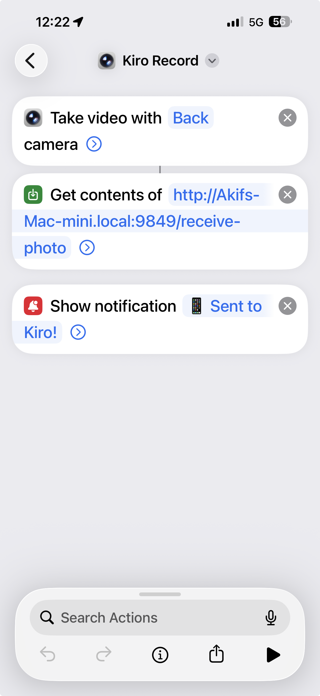

# iPhone Shortcut Setup — Kiro Photo

This guide explains how to set up the "Kiro Photo" Shortcut on your iPhone so that pressing the MX Console "iPhone Camera" button lets you snap a photo and have it appear in Kiro chat.

## Prerequisites

- iPhone with iOS 16+ (Shortcuts app built-in)
- Mac and iPhone on the **same Wi-Fi network**
- Bridge service running on Mac (`npx tsx packages/bridge/src/index.ts`)

## Step 1: Find Your Mac's IP Address

When you press the iPhone Camera button on MX Console, a macOS notification shows:

> 📱 iPhone Camera
> Waiting for photo...
> Mac IP: 192.168.1.42:9849

Note this IP. You'll use it in the Shortcut. (It usually stays the same on your home network.)

## Step 2: Create the iPhone Shortcut

**Quick install:** [Download "Kiro Record" Shortcut](https://www.icloud.com/shortcuts/77cf9e0d6118431d99fcb7f955b2cc55) → Open on iPhone → Change the hostname in the URL to your Mac's hostname from Step 1.

  

**Or create manually:**

Open the **Shortcuts** app on your iPhone and create a new Shortcut named **"Kiro Photo"**:

### Actions (in order):

1. **Take Photo**
   - Camera: Back (or Front, your choice)
   - Show Camera Preview: ON (so you can review before sending)

2. **Resize Image**
   - Width: `1280`
   - Height: Auto

3. **Convert Image**
   - Format: JPEG
   - Quality: 80%

4. **Get Contents of URL**
   - URL: `http://YOUR_MAC_IP:9849/receive-photo`
   - Method: POST
   - Request Body: File
   - File: *(select the output from step 3)*

5. **Show Notification** *(optional)*
   - Body: "📱 Sent to Kiro!"

### Replace `YOUR_MAC_IP` with your actual Mac IP from Step 1.

## Step 3: Add a Quick Trigger

Choose one (or more) for fast access:

| Trigger | How |
|---------|-----|
| Home Screen widget | In Shortcuts → long-press the shortcut → Add to Home Screen |
| Action Button (iPhone 15 Pro+) | Settings → Action Button → Shortcut → select "Kiro Photo" |
| Control Center (iOS 18+) | Settings → Control Center → Add Shortcut |
| Lock Screen widget | Edit Lock Screen → add Shortcuts widget |

## Step 4: macOS Firewall (First Time Only)

The first time the photo receiver starts, macOS may show:

> "Do you want the application 'node' to accept incoming network connections?"

Click **Allow**. This permits your iPhone to reach the Bridge on port 9849.

If you accidentally clicked "Deny":
1. Open System Settings → Network → Firewall → Options
2. Find "node" in the list and set to "Allow incoming connections"

## Usage

1. Press **iPhone Camera** button on MX Console
2. Ghost animation starts (Kiro is waiting)
3. Open **Kiro Photo** shortcut on iPhone (widget/Action Button)
4. Take photo → it auto-sends to Mac
5. Photo appears attached in Kiro chat input
6. Type your prompt and press Enter

## Troubleshooting

### "Connection refused" on iPhone

- Check Mac and iPhone are on the same Wi-Fi network
- Check Bridge is running (`curl http://localhost:9848/health`)
- Check macOS firewall allows node

### "Timed out" notification on Mac

- You have 60 seconds to take the photo after pressing the button
- Press the button again to start a new session

### Photo doesn't appear in Kiro

- Make sure Kiro IDE is running
- Check System Settings → Privacy & Security → Accessibility includes Terminal/Node
- Try pressing the button again

### Wrong IP address

If your Mac IP changed (DHCP):
1. Press the button — new IP shown in notification
2. Update the URL in your iPhone Shortcut

**Pro tip:** Use a static IP or hostname for your Mac to avoid this.

## Advanced: Multiple Macs

If you use this on different Macs, create multiple Shortcut variants:
- "Kiro Photo (Home)" → home Mac IP
- "Kiro Photo (Office)" → office Mac IP

Or use a single Shortcut with a "Choose from Menu" action that selects the IP.
